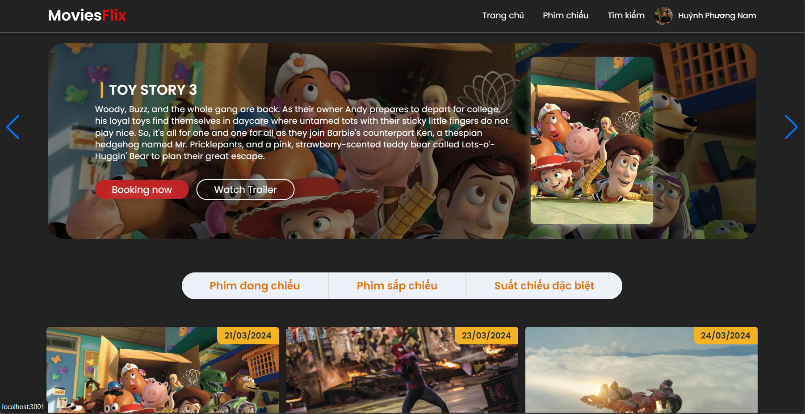
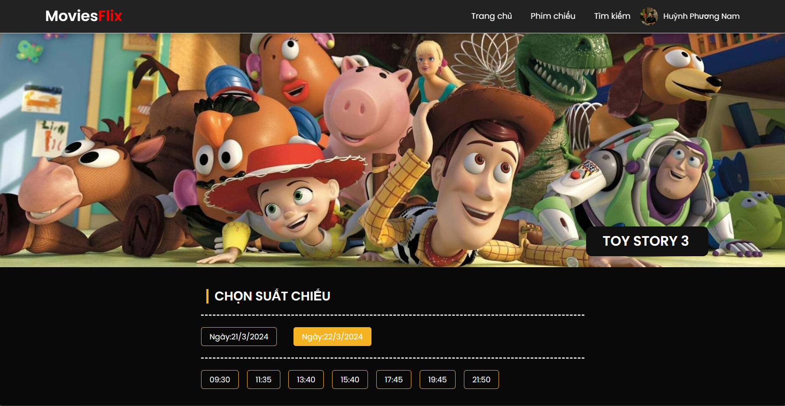
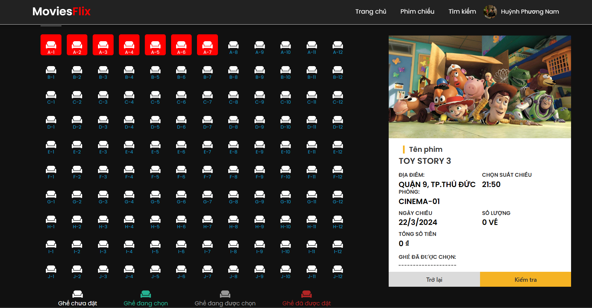
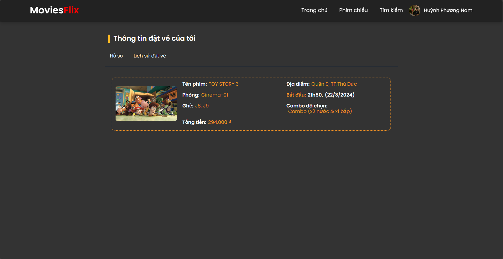

# Website Movie Ticket Booking 

- Client: Our website is used to manage movie showtimes and book tickets. You can easily search for movies and choose the appropriate show time. Customers can easily search and choose the right performance at the time, along with culinary combos during the ticket booking process.
- Administrator: can create screenings, create rooms, and manage booked tickets.

## Home Screen for client

- This screen client can see out website and pick movie, client can use input to search our movies.

## Show time screen

- Client chooose datetime of movies, show description about movies

## Pick chair screen
 
 - Once the user has selected the movie and showtime, they can proceed to choose their seats. They will be able to view information about the movie title, showtime, and available seating. This allows them to confirm their choices before proceeding further.

- Here are some details that the user may see:

    1 Movie Title: The title of the movie they selected.
    2 Showtime: The time at which the selected movie is scheduled to be screened.
    3 Seating Availability: An overview of the available seats, often displayed visually on a seating chart, indicating which seats are already booked and which ones are still available for selection.
    4 The user interface typically provides interactive elements for seat selection, allowing users to click or tap on available seats to add them to their booking. Additionally, they may have options to adjust the number of seats or select seats from different sections of the theater, depending on the layout and configuration of the venue. Once the user has finalized their seat selection, they can proceed to the next steps in the booking process, such as payment and confirmation

## CheckTicket Screen
 
 - User can check what they book and add more pop corns, soft drink and combo

 ## history Ticket Screen
  
- User can check what they book and add more pop corns.
